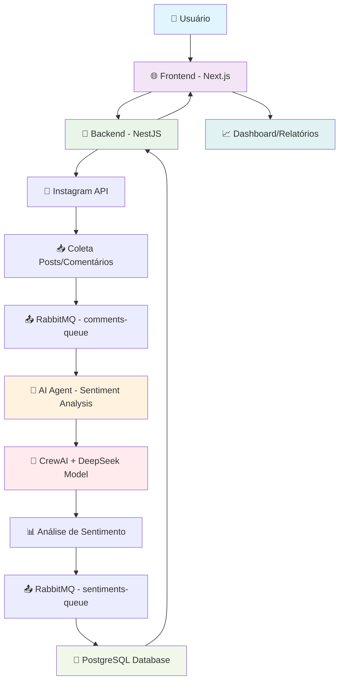

> ⚠️ Este repositório é um **clone/migração** do projeto iniciado anteriormente em
> [Sentiments-Analysis](https://github.com/244Walyson/Sentiments-Analysis).  
> O desenvolvimento atual continua aqui.

# Sentiment Insights - Sistema de Análise de Sentimentos

## 📋 Visão Geral

O **Sentiment Insights** é uma plataforma completa para análise de sentimentos em redes sociais, focada na coleta e análise de posts e comentários do Instagram. O sistema utiliza inteligência artificial avançada para extrair insights valiosos sobre o sentimento dos usuários em relação a marcas, produtos ou tópicos específicos.

## 🏗️ Arquitetura do Sistema

O projeto é composto por 4 componentes principais:

- **Frontend** (Next.js + TypeScript): Interface web para visualização dos dados e relatórios
- **Backend** (NestJS + TypeScript): API REST para gerenciamento de usuários e integração com redes sociais
- **AI Agent API** (Python + CrewAI): Serviço de análise de sentimentos com IA
- **Infraestrutura**: PostgreSQL, RabbitMQ para mensageria assíncrona

## 🔄 Fluxo de Funcionamento



## 📝 Detalhamento do Fluxo

### 1. **Conexão com Redes Sociais**
- O usuário autentica sua conta do Instagram através do OAuth
- O backend armazena tokens de acesso de longa duração
- Sistema suporta múltiplos usuários e contas

### 2. **Coleta de Dados**
- Recuperação automatizada de posts e comentários via Instagram Graph API
- Filtragem por hashtags, perfis ou períodos específicos
- Estruturação dos dados para processamento

### 3. **Processamento Assíncrono**
- Posts/comentários são enviados para a fila `comments-queue` no RabbitMQ
- Sistema de mensageria garante processamento confiável e escalável
- Suporte a processamento em paralelo

### 4. **Análise de Sentimentos**
- **AI Agent** consome mensagens da fila de comentários
- Utiliza **CrewAI** com modelo **DeepSeek** para análise avançada
- Processamento em português e outros idiomas

### 5. **Resultado Estruturado**
O sistema gera análises detalhadas incluindo:
- **Polaridade**: Positivo, Negativo ou Neutro
- **Intensidade**: Fraca, Moderada ou Forte
- **Emoção predominante**: Alegria, raiva, tristeza, etc.
- **Valor numérico**: Escala de 0 a 1
- **Contexto**: Tom, sarcasmo, ironia
- **Entidades mencionadas**: Marcas, produtos, pessoas
- **Hashtags relevantes**
- **Impacto social**: Baixo, médio ou alto

### 6. **Armazenamento e Visualização**
- Resultados são enviados para a fila `sentiments-queue`
- Dados persistidos no PostgreSQL
- Dashboard interativo para visualização dos insights

## 🛠️ Tecnologias Utilizadas

### Frontend
- **Next.js 14** - Framework React
- **TypeScript** - Tipagem estática
- **Tailwind CSS** - Estilização
- **Shadcn/ui** - Componentes UI

### Backend
- **NestJS** - Framework Node.js
- **TypeScript** - Tipagem estática
- **TypeORM** - ORM para PostgreSQL
- **JWT** - Autenticação
- **Axios** - Cliente HTTP

### AI Agent
- **Python 3.12** - Linguagem principal
- **CrewAI** - Framework para agentes de IA
- **DeepSeek R1** - Modelo de linguagem
- **Pika** - Cliente RabbitMQ

### Infraestrutura
- **PostgreSQL 15** - Banco de dados principal
- **RabbitMQ** - Sistema de mensageria
- **Docker** - Containerização

## 🚀 Como Executar

### Pré-requisitos
- Docker e Docker Compose
- Node.js 18+
- Python 3.12+
- Chaves de API do Instagram

### 1. Clone o repositório
```bash
git clone git@github.com:244Walyson/AS.git sentiment-insights
cd sentiment-insights
```

### 2. Configure as variáveis de ambiente
```bash
# Backend
cp backend/.env.example backend/.env

# Configure as credenciais do Instagram:
INSTAGRAM_CLIENT_ID=your_client_id
INSTAGRAM_CLIENT_SECRET=your_client_secret
INSTAGRAM_REDIRECT_URI=your_redirect_uri
```

### 3. Inicie a infraestrutura
```bash
docker-compose up -d
```

### 4. Instale dependências e execute os serviços

**Backend:**
```bash
cd backend
npm install
npm run migration:run
npm run start:dev
```

**Frontend:**
```bash
cd frontend
npm install
npm run dev
```

**AI Agent:**
```bash
cd ai-agent-api
pip install -r requirements.txt
python src/main.py
```

## 📊 Funcionalidades

- ✅ **Autenticação OAuth** com Instagram
- ✅ **Coleta automática** de posts e comentários
- ✅ **Análise de sentimentos** com IA avançada
- ✅ **Processamento assíncrono** e escalável
- ✅ **Dashboard interativo** para visualização
- ✅ **Relatórios detalhados** em tempo real
- ✅ **Suporte multi-idioma** (português, inglês, etc.)
- ✅ **Detecção de sarcasmo** e ironia
- ✅ **Análise de entidades** mencionadas

## 🔮 Roadmap

- [ ] Integração com outras redes sociais (Twitter, Facebook, TikTok)
- [ ] Análise de tendências temporais
- [ ] Alertas automáticos para sentimentos negativos
- [ ] API pública para desenvolvedores
- [ ] Exportação de relatórios em PDF/Excel
- [ ] Análise de influenciadores e reach

## 🤝 Contribuição

Contribuições são bem-vindas! Por favor, leia as diretrizes de contribuição antes de submeter pull requests.

## 📄 Licença

Este projeto está sob a licença MIT. Veja o arquivo `LICENSE` para mais detalhes.

---

**Desenvolvido com ❤️ para insights inteligentes de redes sociais**
